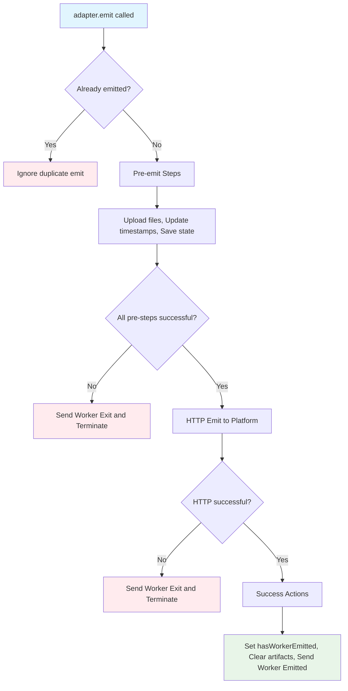
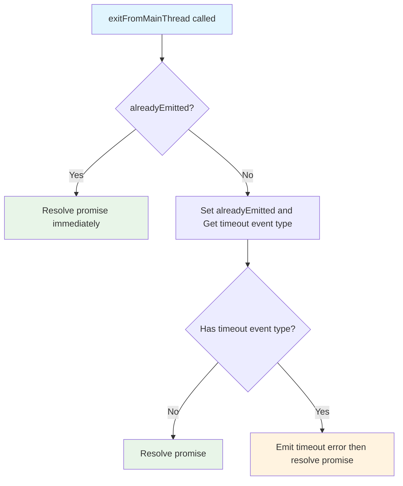

# Airdrop snap-in timeout handling

```mermaid
sequenceDiagram
    participant S as Airdrop Snap-in

    box Airdrop SDK
        participant MT as Main Thread
        participant WT as Worker Thread
    end

    Note over S: Receives Airdrop event<br/>(JSON)

    S->>S: Determines worker script<br/>based on event type

    S->>MT: Calls spawn function<br/>and waits for completion

    MT->>WT: Creates worker thread<br/>with selected script
    MT->>MT: Sets up 10-minute timer<br/>for timeout handling
    MT->>MT: Starts listening for<br/>worker messages

    rect rgb(200, 230, 255)
        WT->>MT: Worker Message: Log
        MT->>MT: Logs message using<br/>main thread logger
    end

    WT->>WT: Creates SDK helper instances<br/>and listens for messages<br/>from main thread
    WT->>WT: Gets task and onTimeout functions<br/>(defined by developer)
    WT->>WT: Starts task function execution

    Note over S, WT: Task function execution can lead to different scenarios:

    rect rgb(200, 255, 200)
        Note over S, WT: Scenario 1: Successful task execution
        WT->>WT: Task completes successfully
        WT->>WT: Task emits successfully
        WT->>MT: Worker Message: Emitted
        MT->>MT: Sets alreadyEmitted flag<br/>to true in main thread
        WT->>WT: Calls process.exit(0)
        WT->>MT: Worker Exit (triggered by process.exit)
        MT->>MT: Clears timer<br/>Calls exitFromMainThread()
        MT->>S: Promise resolved
    end

    rect rgb(200, 255, 200)
        Note over S, WT: Scenario 2: Soft timeout after 10 minutes (worker not blocked)
        MT->>WT: Main thread Message: Exit
        WT->>WT: Set isTimeout flag in adapter<br/>to true
        WT->>WT: Executes onTimeout function<br/>(developer cleanup logic)
        WT->>WT: onTimeout calls emit successfully
        WT->>MT: Worker Message: Emitted
        MT->>MT: Sets alreadyEmitted flag
        WT->>WT: Calls process.exit(0)
        WT->>MT: Worker Exit (triggered by process.exit)
        MT->>MT: Clears timer<br/>Calls exitFromMainThread()
        MT->>S: Promise resolved
    end

    rect rgb(255, 220, 220)
        Note over S, WT: Scenario 3: Soft timeout after 10 minutes (worker blocked)

        MT->>WT: Main thread Message: Exit
        Note over WT: Worker thread busy with<br/>intensive synchronous task
        Note over WT: Worker event loop blocked -<br/>cannot receive exit message
        Note over MT: Main thread waits for response<br/>but worker thread is unresponsive
        Note over S, WT: Lambda continues past 10min soft timeout<br/>Eventually hits 13min hard timeout

        Note over S, WT: Prevent this scenario?<br/><br/>- Use async/await for I/O operations - keeps event loop free?<br/>- Check adapter.isTimeout periodically in loops - enables early exit?<br/>- Kill worker thread?
    end

    rect rgb(255, 220, 220)
        Note over S, WT: Scenario 4: Unsuccessful task execution (no emit)
        WT->>WT: Task execution fails
        WT->>WT: Task does not emit successfully
        WT->>MT: Worker Message: Done
        MT->>MT: Clears timer<br/>Calls exitFromMainThread()
        WT->>WT: Calls process.exit(0)
        WT->>MT: Worker Exit (triggered by process.exit)
        MT->>MT: Calls exitFromMainThread()<br/>Resolves promise
        MT->>S: Promise resolved<br/>Snap-in execution completes
    end

    rect rgb(255, 220, 220)
        Note over S, WT: Scenario 5: Worker Creation Error
        MT->>WT: Attempts to create worker thread
        WT->>MT: Worker Error event fired
        Note over MT: createWorker promise rejected
        MT->>MT: Catches error in spawn function<br/>Logs "Worker error while processing task"
        Note over MT: Promise never resolved<br/>(Potential issue - promise hangs)
        Note over S: Snap-in waits indefinitely<br/>Lambda will timeout
    end

```

## emit() function flow diagram

```mermaid
flowchart TD
    A[adapter.emit called] --> B{Already emitted?}

    B -->|Yes| C[Ignore duplicate emit]

    B -->|No| D[Pre-emit Steps]
    D --> E[Upload files, Update timestamps, Save state]

    E --> F{All pre-steps successful?}
    F -->|No| G[Send Worker Exit and Terminate]

    F -->|Yes| H[HTTP Emit to Platform]
    H --> I{HTTP successful?}

    I -->|No| J[Send Worker Exit and Terminate]
    I -->|Yes| K[Success Actions]
    K --> L[Set hasWorkerEmitted, Clear artifacts, Send Worker Emitted]

    style A fill:#e1f5fe
    style C fill:#ffebee
    style G fill:#ffebee
    style J fill:#ffebee
    style L fill:#e8f5e8
```

## exitFromMainThread() function flow diagram

```mermaid
flowchart TD
    A[exitFromMainThread called] --> B{alreadyEmitted?}

    B -->|Yes| C[Resolve promise immediately]

    B -->|No| D[Set alreadyEmitted and Get timeout event type]

    D --> E{Has timeout event type?}

    E -->|No| F[Resolve promise]
    E -->|Yes| G[Emit timeout error then resolve promise]

    style A fill:#e1f5fe
    style C fill:#e8f5e8
    style F fill:#e8f5e8
    style G fill:#fff3e0
```
